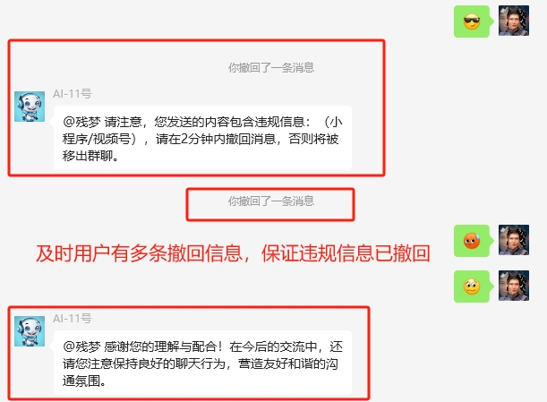
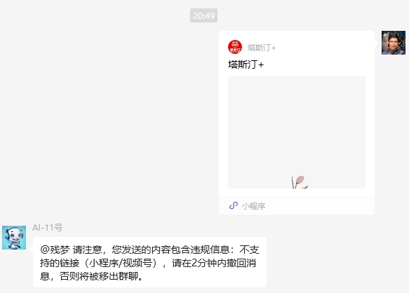
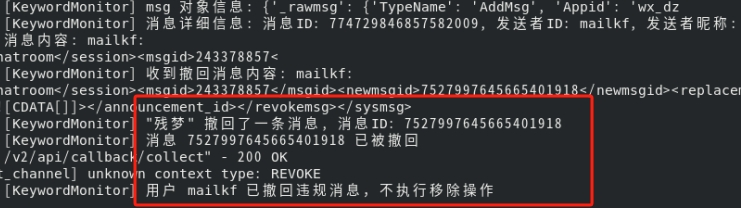

# KeywordMonitor 插件

2025年3月26日更新文件“KeywordMonitorPlugin-0.1.25.py”“config-0.1.25.json” 直接适配DOW 0.1.25 无需修改DOW的其他文件，意思就是说无需**【替换文件：(请替换前备份以前的文件)

    bridge\context.py
    
    channel\gewechat\gewechat_channel.py
    
    channel\gewechat\gewechat_message.py
    
】** 操作，请注意，无需操作。

**如你是DOW 0.1.25**

只需要文件“**KeywordMonitorPlugin-0.1.25.py**”“**config-0.1.25.json**” “**__init__.py**”放置到目录“**\plugins\KeywordMonitorPlugin**” 修改去掉“**KeywordMonitorPlugin-0.1.25.py**”“**config-0.1.25.json**” 文件名称**-0.1.25**完整的是
\plugins\KeywordMonitorPlugin\__init__.py

\plugins\KeywordMonitorPlugin\config.json

\plugins\KeywordMonitorPlugin\KeywordMonitorPlugin.py


**如你是DOW 0.1.25 前版本**

则不需要“**KeywordMonitorPlugin-0.1.25.py**”“**config-0.1.25.json**” 两个文件，还需要替换原DOW相关文件。


## 简介

KeywordMonitor 是一个用于 https://github.com/hanfangyuan4396/dify-on-wechat 利用GTP来监控群聊关键词、URL链接和文件内容的插件。当检测到违规内容时，插件会自动发送警告消息，并要求用户在2分钟内撤回违规消息。如果用户未在规定时间内撤回消息，插件将自动将其移出群聊。该插件旨在帮助群管理员自动管理群聊内容，减少人工干预，确保群聊环境的健康和安全。

根目录下comfig.json需要有配置，本插件是通过AI分析URL是否违规：
```json
    "model": "kimi",
    "open_ai_api_base": "https://***/v1",
    "open_ai_api_key": "sk-xTYifeB7vMG2mUp4111816A4C6124f8cA0Dc741528E04cDd",
    "gewechat_app_id": "wx_d***********",
    "gewechat_base_url": "http://192.168.10.123:2531/v2/api",
    "gewechat_token": "2*******************",
```
## 示例图



如果用户撤回了消息，我们发送一条感谢消息，提醒用户保持良好的聊天行为。





## 插件使用要求：
### 替换文件：(请替换前备份以前的文件)
   - bridge\context.py
   - channel\gewechat\gewechat_channel.py
   - channel\gewechat\gewechat_message.py

### 将插件安装到 /plugins/KeywordMonitorPlugin

## 功能特性

### 1. **关键词监控**
   - 监控群聊消息中的关键词，支持自定义关键词列表。
   - 当消息中包含配置的关键词时，插件会发送警告消息，并要求用户在2分钟内撤回违规消息。
   - 支持动态加载关键词列表，无需重启插件即可生效。

### 2. **URL链接监控**
   - 检测消息中的URL链接，支持自定义广告链接和不支持的链接模式。
   - 如果链接匹配广告URL模式或不支持的URL模式，插件会发送警告消息，并要求用户撤回违规消息。
   - 支持对URL内容进行深度分析，判断是否包含违规信息。

### 3. **文件内容监控**
   - 检测消息中的文件内容，支持分析文件内容是否违规。
   - 如果文件内容包含违规信息，插件会发送警告消息，并要求用户撤回违规消息。
   - 支持多种文件格式的内容提取和分析。

### 4. **自动移除用户**
   - 当用户多次违规或未在规定时间内撤回违规消息时，插件会自动将其移出群聊。
   - 支持设置警告次数限制，达到次数后自动移除用户。

### 5. **白名单支持**
   - 支持设置白名单用户，白名单用户发送的消息不会被监控。
   - 白名单用户即使发送违规内容，也不会触发警告或移除操作。

### 6. **忽略@机器人的消息**
   - 支持忽略@机器人的消息，避免误判。
   - 当消息中包含@机器人的内容时，插件会自动忽略该消息，不进行监控。

### 7. **消息撤回处理**
   - 支持处理消息撤回事件，记录撤回的消息ID。
   - 如果用户在2分钟内撤回了违规消息，插件不会执行移除操作。

### 8. **违规记录管理**
   - 记录每个用户的违规消息ID和违规次数。
   - 支持将违规记录保存到本地文件，重启插件后仍可保留历史记录。
   - 支持手动清除违规记录。

### 9. **多群组监控**
   - 支持同时监控多个群组，群组名称可在配置文件中自定义。
   - 每个群组可以独立设置监控规则和白名单。

### 10. **警告消息自定义**
   - 支持自定义警告消息内容，管理员可以根据需要调整警告提示。
   - 警告消息中可以包含违规类型、用户昵称等信息。

### 11. **插件启停控制**
   - 支持动态启用或停用插件，无需重启系统。
   - 插件状态可以在配置文件中进行设置。

### 12. **日志记录**
   - 详细的日志记录功能，记录插件的运行状态、监控结果和错误信息。
   - 日志信息包括消息ID、发送者ID、群组名称、违规类型等。

## 安装与配置

### 1. 安装插件

将 `KeywordMonitorPlugin.py` 和 `config.json` 文件放置在插件目录中，并在 `__init__.py` 中导入插件。

### 2. 配置插件

编辑 `config.json` 文件，配置插件的各项参数：

```json
{
  "enabled": true,  // 是否启用插件
  "keywords": ["话费充值打折", "抖音退费", "机票退改签", "会员退费", "培训学费退费", "网络高薪兼职"],  // 监控的关键词列表
  "monitored_groups": ["三人行", "AI外卖员"],  // 监控的群名称列表
  "whitelist": [],  // 白名单用户ID列表
  "ignore_at_bot_msg": true,  // 是否忽略@机器人的消息
  "url_check_enabled": true,  // 是否开启URL检测
  "keyword_check_enabled": true,  // 是否开启关键词检测
  "file_check_enabled": true,  // 是否开启文件检测
  "warning_limit": 20,  // 警告次数限制
  "ad_url_patterns": [  // 广告URL模式
    ".*ad\\.com.*",
    ".*doubleclick\\.net.*",
    ".*googleads\\.g\\.doubleclick\\.net.*",
    ".*ads\\.yahoo\\.com.*",
    ".*tracking\\.com.*",
    ".*affiliate\\.com.*",
    ".*promo\\.com.*"
  ],
  "unsupported_url_patterns": [  // 不支持的URL模式
    ".*finder\\.video\\.qq\\.com.*",
    ".*support\\.weixin\\.qq\\.com/update.*",
    ".*support\\.weixin\\.qq\\.com/security.*",
    ".*mp\\.weixin\\.qq\\.com/mp/waerrpage.*"
  ]
}
```

### 3. 启动插件

确保插件配置文件正确后，启动插件。插件会自动加载配置并开始监控指定的群聊。

## 使用说明

### 1. 关键词监控

插件会监控群聊消息中的关键词。当检测到消息中包含配置的关键词时，插件会发送警告消息，并要求用户在2分钟内撤回违规消息。

### 2. URL链接监控

插件会检测消息中的URL链接。如果链接匹配广告URL模式或不支持的URL模式，插件会发送警告消息，并要求用户撤回违规消息。

### 3. 文件内容监控

插件会检测消息中的文件内容。如果文件内容包含违规信息，插件会发送警告消息，并要求用户撤回违规消息。

### 4. 自动移除用户

当用户多次违规或未在规定时间内撤回违规消息时，插件会自动将其移出群聊。

### 5. 白名单支持

白名单用户发送的消息不会被监控。即使白名单用户发送了违规内容，插件也不会触发警告或移除操作。

### 6. 忽略@机器人的消息

当消息中包含@机器人的内容时，插件会自动忽略该消息，不进行监控。

### 7. 消息撤回处理

插件会记录撤回的消息ID。如果用户在2分钟内撤回了违规消息，插件不会执行移除操作。

### 8. 违规记录管理

插件会记录每个用户的违规消息ID和违规次数。违规记录可以保存到本地文件，重启插件后仍可保留历史记录。

### 9. 多群组监控

插件支持同时监控多个群组，每个群组可以独立设置监控规则和白名单。

### 10. 警告消息自定义

管理员可以根据需要自定义警告消息内容，警告消息中可以包含违规类型、用户昵称等信息。

### 11. 插件启停控制

插件支持动态启用或停用，无需重启系统。插件状态可以在配置文件中进行设置。

### 12. 日志记录

插件会记录详细的日志信息，包括消息ID、发送者ID、群组名称、违规类型等，方便管理员查看和排查问题。

## 注意事项

- 插件仅支持 `gewechat` 渠道，确保在配置文件中正确配置 `gewechat_base_url`、`gewechat_token` 和 `gewechat_app_id`。
- 插件依赖于外部API进行内容分析，确保配置文件中正确配置 `open_ai_api_key` 和 `open_ai_api_base`。

## 帮助与支持

如需帮助或支持，请联系插件作者：mailkf。

## 版本历史
- 2025年1月20日：
- **0.9.1**：增加如果用户撤回了消息，我们发送一条感谢消息，提醒用户保持良好的聊天行为。
- 增加了白名单功能，对域名过滤，优化提示词，增加了gewechat_message.py对表情与视频的识别。
- **0.9.0**：初始版本发布，支持关键词、URL链接和文件内容监控。
```
